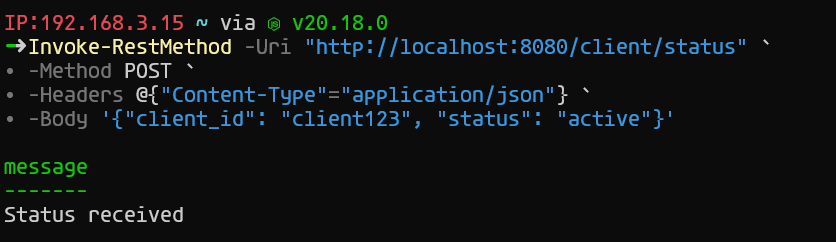
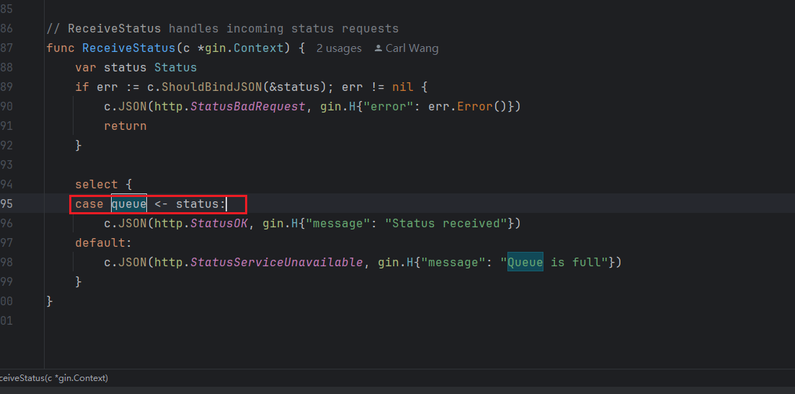
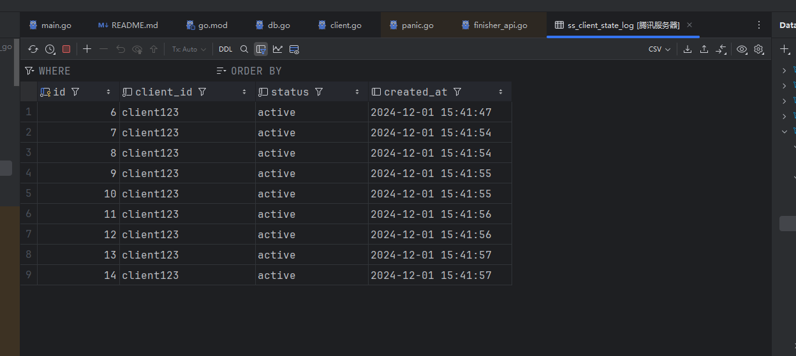

### 使用说明
#### 核心逻辑在[client.go](routes/client.go) 这个文件中
#### 解析：
ReceiveStatus用于接收客户端请求，例如：使用powershell执行以下代码
```
Invoke-RestMethod -Uri "http://localhost:8080/client/status" `
∙ -Method POST `
∙ -Headers @{"Content-Type"="application/json"} `
∙ -Body '{"client_id": "client123", "status": "active"}'
```
就像这样

看到 Status received 代表请求成功，同样的，可以在linux系统使用curl，
```
curl -X POST http://localhost:8080/client/status \
     -H "Content-Type: application/json" \
     -d '{
    "client_id": "client123",
    "status": "active"
}'
     
```
ReceiveStatus接收到请求后，会将客户端发送来的消息放在队列中 queue，
，然后就返回给前端了，这个时候，这条数据还没有存储到mysql，而是在队列中，然后通过ProcessQueue这个方法，不停的轮训，如果有客户端的消息了，
就会取出来并放在batch中，系统会每隔400毫秒执行一次batch insert，每一次最多插入100条，插入的逻辑是BatchInsert方法。

#### 表结构
```sql
create table ss_client_state_log
(
    id         int auto_increment
        primary key,
    client_id  varchar(255)                        not null,
    status     text                                not null,
    created_at timestamp default CURRENT_TIMESTAMP null
);
```
可以根据自己的实际情况进行修改

#### 结果


